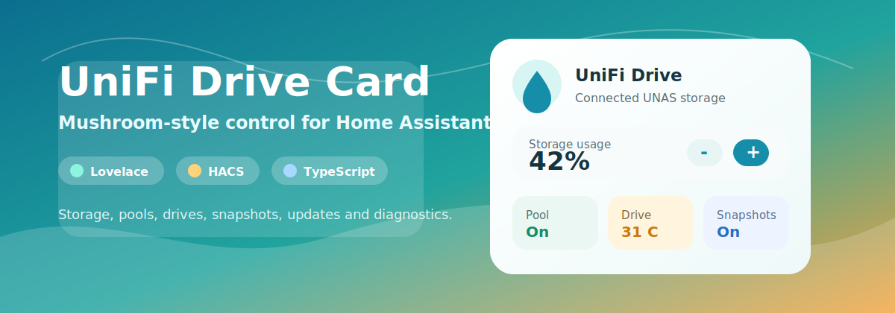

<p align="center">
  
</p>

# Drive Storage Card

[](https://github.com/memphi2/ha-unifi-drive-card/actions/workflows/ci.yml)
[](https://hacs.xyz/docs/faq/custom_repositories)
[](LICENSE)

Mushroom-style Lovelace card for the `unifi_drive` Home Assistant integration.
It discovers compatible UniFi Drive / UNAS storage, pool, drive, snapshot, system and
update entities from Home Assistant registry metadata and renders them as one
compact dashboard card.

Built with Codex.

## Highlights

- Automatic discovery for enabled `unifi_drive` entities.
- Dynamic grouping for pools, drives, snapshot targets and backup tasks.
- Safe defaults: shutdown/restart stay hidden until `show_dangerous_actions` is enabled.
- Width-aware layout: dashboard column changes automatically reorder blocks into vertical or wide views.
- Native controls for switches, buttons, numbers, selects, time entities and updates.
- Home Assistant action support for tap, hold and double tap.
- Visual editor for sections, entity overrides, hidden entities and actions.
- CI-ready TypeScript, lint, Vitest, HACS compatibility and browser smoke tests.
- Live Home Assistant smoke supports install and uninstall checks without committing credentials.

## Quick Start

```yaml
type: custom:unifi-drive-card
```

The card can auto-discover the first enabled UniFi Drive entity. For multi-device
systems, set an anchor entity or device ID:

```yaml
type: custom:unifi-drive-card
entity: sensor.unifi_drive_system_status
device_id: your_home_assistant_device_id
```

## Installation

HACS resource:

```yaml
url: /hacsfiles/ha-unifi-drive-card/ha-unifi-drive-card.js
type: module
```

Manual build:

```bash
npm ci
npm run build
```

Manual resource:

```yaml
url: /local/community/ha-unifi-drive-card/ha-unifi-drive-card.js
type: module
```

## Configuration

```yaml
type: custom:unifi-drive-card
name: UniFi Drive
compact: true
show_unavailable: false
show_optional: false
show_diagnostics: true
show_dangerous_actions: false
show_icon_animations: true
max_sensor_rows: 10
sections:
  - overview
  - storage
  - pools
  - drives
  - snapshots
  - system
  - updates
  - diagnostics
  - actions
tap_action:
  action: more-info
hold_action:
  action: navigate
  navigation_path: /lovelace/unifi-drive
```

Common options:

| Option | Default | Purpose |
| --- | --- | --- |
| `entity` | auto-discovered | Optional anchor entity for discovery. |
| `device_id` | registry device | Restricts discovery to one HA device. |
| `sections` | all sections | Ordered visible sections. |
| `show_dangerous_actions` | `false` | Shows restart/shutdown actions with confirmation. |
| `hide_entities` | `[]` | Known entity keys to hide. |
| `entities` | `{}` | Per-key entity overrides. |
| `compact` | `true` | Uses the compact layout by default. |
| `max_sensor_rows` | `10` | Row limit for list sections. |

The card is responsive to its own dashboard width. Narrow columns render as a
vertical card; wider dashboard cards reorder the section blocks so storage,
system and update blocks appear earlier in a horizontal dashboard layout, with
multi-column entity rows where space allows.

## Validation

```bash
npm run check
npm run render-smoke
npm run anonymization-check
npm run security-audit
```

Live Home Assistant smoke uses environment variables only:

```bash
HA_TEST_URL=http://<ha-host>:8123 \
HA_TEST_USERNAME='<user>' \
HA_TEST_PASSWORD='<password>' \
HA_CARD_DEPLOY_DIR=/path/to/ha/config/www/community/ha-unifi-drive-card \
HA_CARD_CONFIG_DIR=/path/to/ha/config \
npm run smoke:install-uninstall
```

Do not commit hostnames, IPs, tokens, passwords or screenshots with private data.

## Docs

- [Installation](docs/installation.md)
- [Configuration](docs/configuration.md)
- [Troubleshooting](docs/troubleshooting.md)
- [Development and smoke tests](docs/development.md)
- [Legal notes](docs/legal.md)
- [Release process](RELEASING.md)
- [0.1.0 release notes](release-notes/v0.1.0.md)
- [Changelog](CHANGELOG.md)

## Trademark Notice

UniFi and Ubiquiti are trademarks or registered trademarks of Ubiquiti Inc.
Home Assistant is a trademark of its owner. This project is independent and is
not affiliated with, sponsored by or endorsed by Ubiquiti, Home Assistant or
HACS. Third-party names are used only to identify compatible products and
software.
