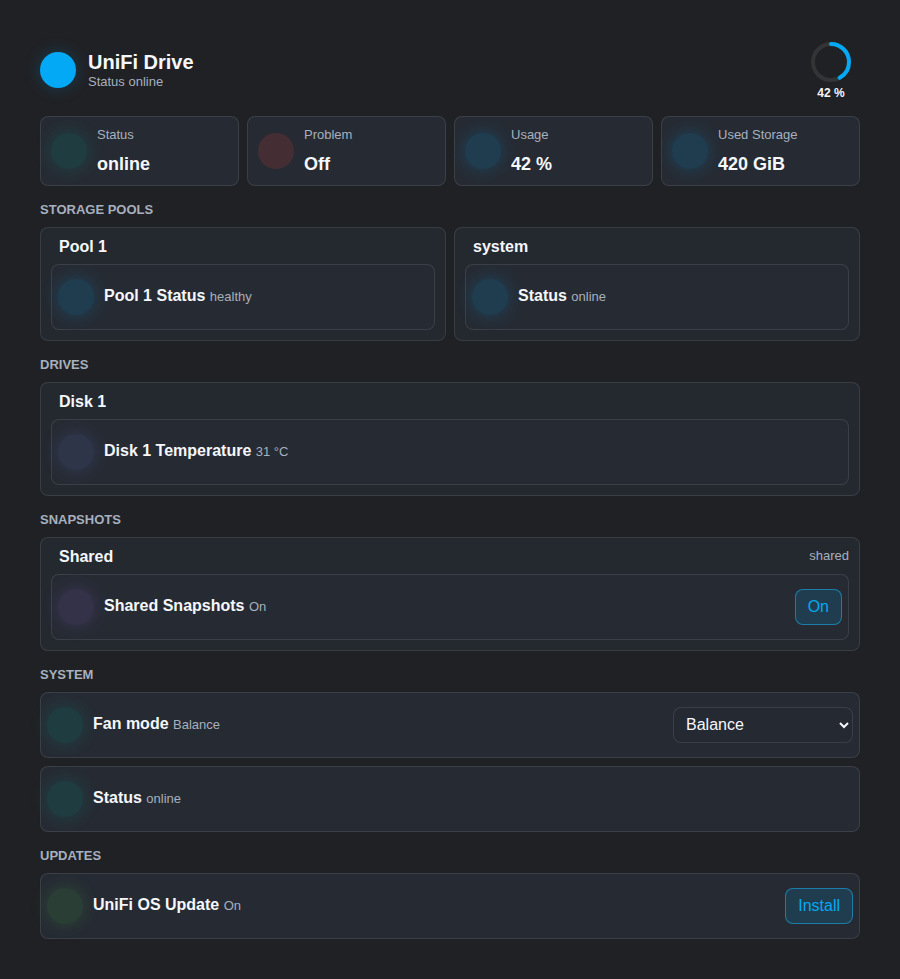
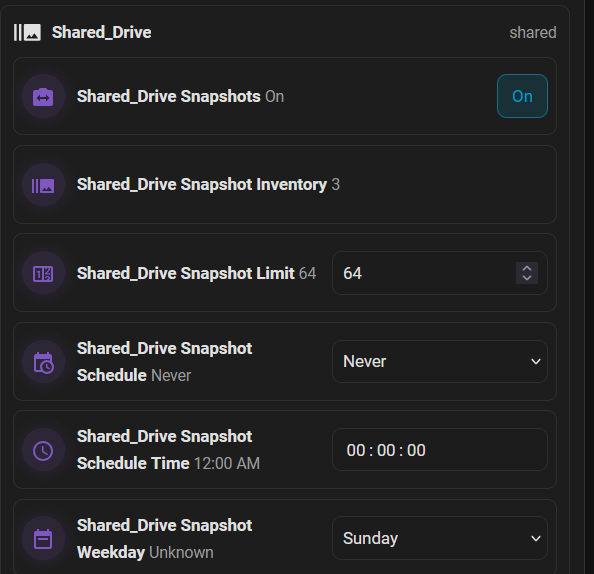
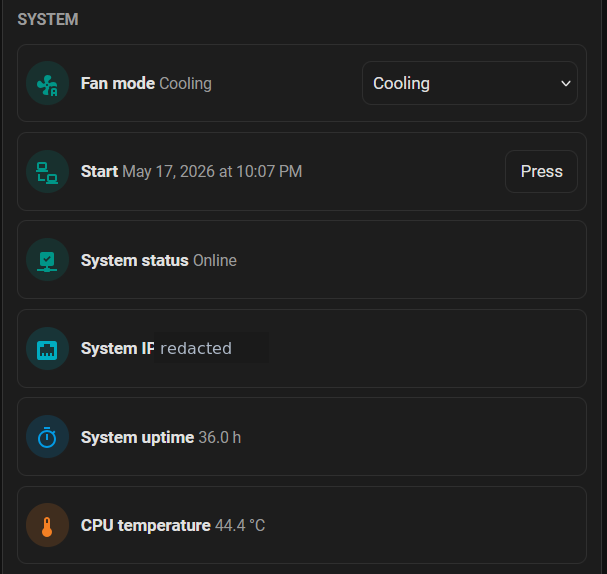
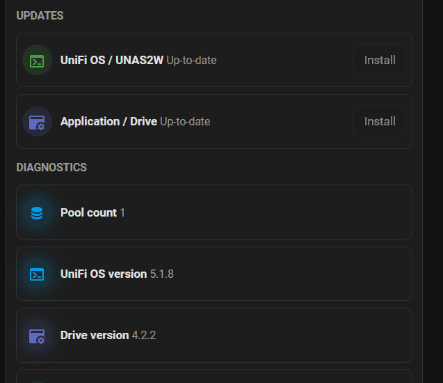

# Drive Storage Card

[](https://github.com/memphi2/ha-unifi-drive-card/actions/workflows/ci.yml)
[](https://hacs.xyz/docs/faq/custom_repositories)
[](LICENSE)

Mushroom-style Lovelace card for the `unifi_drive` Home Assistant integration.
It discovers compatible UniFi Drive / UNAS storage, pool, drive, snapshot, system and
update entities from Home Assistant registry metadata and renders them as one
compact dashboard card.

Built with Codex.

## Screenshots

| Compact overview | Snapshot controls |
| --- | --- |
|  |  |
| System controls | Updates and diagnostics |
|  |  |

## Highlights

- Automatic discovery for enabled `unifi_drive` entities.
- Dynamic grouping for pools, drives, snapshot targets and backup tasks.
- Safe defaults: shutdown/restart stay hidden until `show_dangerous_actions` is enabled.
- Width-aware layout: dashboard column changes automatically reorder blocks into vertical or wide views.
- Native controls for switches, buttons, numbers, selects, time entities and updates.
- Home Assistant action support for tap, hold and double tap.
- Visual editor for sections, entity overrides, hidden entities and actions.
- CI-ready TypeScript, lint, Vitest, HACS compatibility and browser smoke tests.
- Live Home Assistant smoke supports install and uninstall checks without committing credentials.

## Quick Start

```yaml
type: custom:unifi-drive-card
```

The card can auto-discover entities, but for multi-device setups set the Home
Assistant device explicitly:

```yaml
type: custom:unifi-drive-card
device_id: your_home_assistant_device_id
```

## Installation

HACS resource:

```yaml
url: /hacsfiles/ha-unifi-drive-card/ha-unifi-drive-card.js
type: module
```

Manual build:

```bash
npm ci
npm run build
```

Manual resource:

```yaml
url: /local/community/ha-unifi-drive-card/ha-unifi-drive-card.js
type: module
```

## Configuration

```yaml
type: custom:unifi-drive-card
name: UniFi Drive
compact: true
show_unavailable: false
show_optional: false
show_diagnostics: true
show_dangerous_actions: false
show_icon_animations: true
overview_columns: 3
sections:
  - overview
  - storage
  - pools
  - drives
  - snapshots
  - system
  - updates
  - diagnostics
  - actions
tap_action:
  action: more-info
hold_action:
  action: navigate
  navigation_path: /lovelace/unifi-drive
```

Common options:

| Option | Default | Purpose |
| --- | --- | --- |
| `device_id` | required | Restricts discovery to one HA device. |
| `sections` | all sections | Ordered visible sections. |
| `show_dangerous_actions` | `false` | Shows restart/shutdown actions with confirmation. |
| `hide_entities` | `[]` | Known entity keys to hide. |
| `entities` | `{}` | Per-key entity overrides. |
| `compact` | `true` | Uses the compact layout by default. |
| `overview_columns` | `3` | Default overview tile columns, bounded from 1 to 6 and collapsed to one column in very narrow cards. |

The card is responsive to its own dashboard width. Narrow columns render as a
vertical card; wider dashboard cards reorder the section blocks so storage,
system and update blocks appear earlier in a horizontal dashboard layout, with
multi-column entity rows where space allows.

## Validation

```bash
npm run check
npm run render-smoke
npm run anonymization-check
npm run security-audit
```

Live Home Assistant smoke uses environment variables only:

```bash
HA_TEST_URL=http://<ha-host>:8123 \
HA_TEST_USERNAME='<user>' \
HA_TEST_PASSWORD='<password>' \
HA_CARD_DEPLOY_DIR=/path/to/ha/config/www/community/ha-unifi-drive-card \
HA_CARD_CONFIG_DIR=/path/to/ha/config \
npm run smoke:install-uninstall
```

Do not commit hostnames, IPs, tokens, passwords or screenshots with private data.

## Docs

- [Installation](docs/installation.md)
- [Configuration](docs/configuration.md)
- [Troubleshooting](docs/troubleshooting.md)
- [Development and smoke tests](docs/development.md)
- [Legal notes](docs/legal.md)
- [Release process](RELEASING.md)
- [0.2.2 release notes](release-notes/v0.2.2.md)
- [0.2.1 release notes](release-notes/v0.2.1.md)
- [Changelog](CHANGELOG.md)

## Compliance Notice

This project is an independent, MIT-licensed Lovelace custom card. It ships
frontend code only and does not include, modify or redistribute UniFi firmware,
Home Assistant, HACS, Mushroom, or any vendor cloud service. Users remain
responsible for complying with the terms that apply to their own Home Assistant
installation, HACS setup, UniFi hardware, UniFi OS installation and local
network policies.

The repository avoids vendor logos, copied vendor UI, proprietary type styles,
vendor trade dress, private hostnames, internal IP addresses, tokens and
credentials in committed files. Screenshots and examples are generated from
synthetic or redacted data. Live smoke tests must use environment variables and
must not commit secrets.

## Acknowledgements

- Home Assistant provides the dashboard and custom-card platform this card is
  built for.
- HACS provides the custom repository distribution path used by many Home
  Assistant installations.
- Mushroom influenced the compact Home Assistant card style referenced in this
  project description; no Mushroom source code, logos or assets are bundled.
- Ubiquiti and the UniFi product ecosystem provide the compatible storage
  devices and entities this card can display.
- Lit and the related runtime packages are bundled under their original
  open-source licenses; see [third-party notices](THIRD_PARTY_NOTICES.md).
- Initial implementation and release hardening were built with Codex.

## Trademark Notice

UniFi and Ubiquiti are trademarks or registered trademarks of Ubiquiti Inc. or
its affiliates. Home Assistant, HACS and Mushroom are third-party names and may
be trademarks or project identifiers of their respective owners. This project is
independent and is not affiliated with, sponsored by or endorsed by Ubiquiti,
Home Assistant, HACS or Mushroom.

Third-party names are used only for truthful, descriptive compatibility
references. `Drive Storage Card` is the user-facing project name; repository,
custom element and Home Assistant identifiers such as `ha-unifi-drive-card`,
`unifi-drive-card` and `unifi_drive` are retained for technical compatibility
and should not be read as ownership of any third-party mark.
